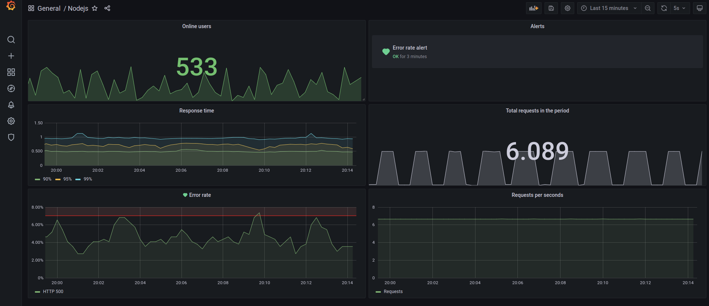

# Monitoring Nodejs with Prometheus and Grafana

> Monitoramento de Nodejs com Prometheus e Grafana.

### Urls

- [Node Api](http:localhost:8080)
- [Prometheus](http:localhost:9090)
- [Grafana](http:localhost:3000)

    

